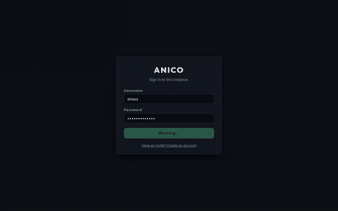
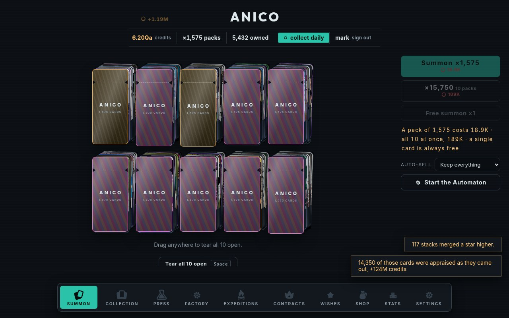
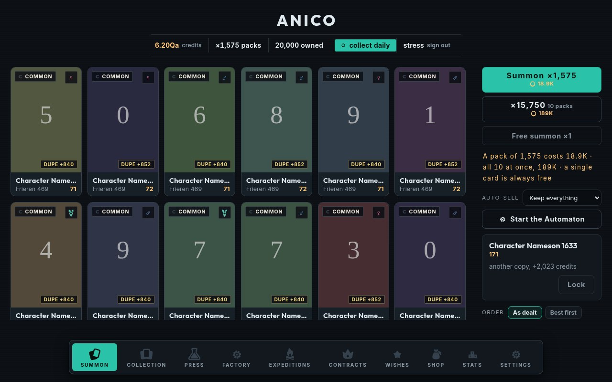
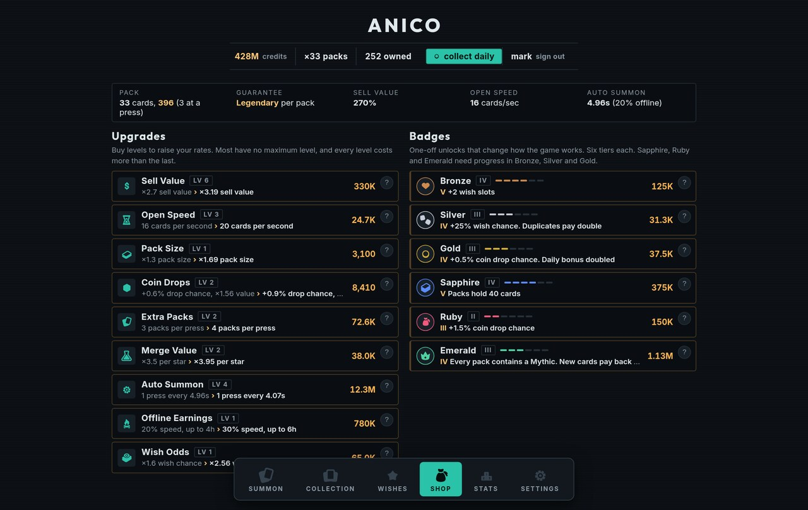
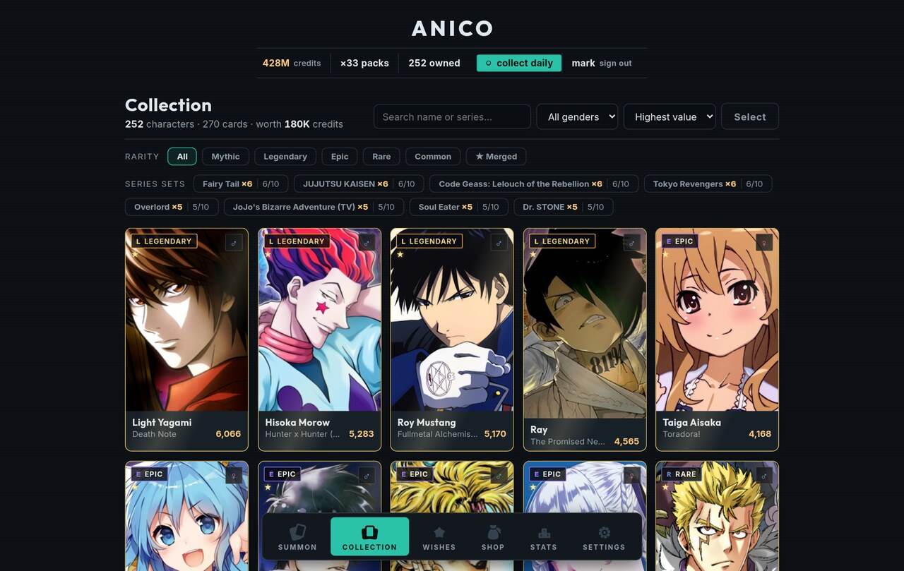

# Anico 🎴

A self-hosted anime card collecting game. No Discord bot, no commands: a web app you run
on your own box, open in a browser, and play. Pull packs, keep what you like, sell the
rest, and spend the credits on a shop that never runs out of things to sell you.



Character data and art come from the [AniList GraphQL API](https://docs.anilist.co/),
fetched once by the server and cached in the instance's own database. One deployment is
an **instance**; players share it but their collections are separate, so two people can
own the same character and nobody can take one away from anyone else.

## What you do

### Pull packs

A summon is free and unlimited. Packs cost credits and hold more cards: 10 at the first
Sapphire badge, 60 by the last, and thousands once Pack Size has a few levels on it. Buy
Extra Packs and you open several at once, side by side.

Packs are sealed. By hand, one drag tears every wrapper in the pull and each swipe after
that takes the top card off every stack, so five packs are the same gesture as one. Hands
off, <kbd>Space</kbd> and the button open them one at a time at your current open speed.
It is only ceremony: every card is yours the moment the pack is bought, so closing the tab
mid-tear costs nothing.

How much of a pull arrives as real cards is what **Open Speed** buys: six seconds of cards
a second, from two hundred up to a thousand. Everything else is appraised into credits at
what those cards averaged, as the pack drains, because each card you throw carries its
share of the pack with it. A wrapper is labelled with everything it holds and its counter
runs to zero ([ADR 0007](./docs/adr/0007-the-numbers-have-no-ceiling.md)).



### Keep what is worth keeping

Duplicates stack. Every doubling merges a stack one star higher (★1 at two copies, ★2 at
four, ★3 at eight) and each star multiplies what the whole stack sells for, so holding
sixteen copies beats selling them as they arrive.

Set **auto-sell** to a rarity and anything below it is marked for sale, then sold when
you next summon. That gap is deliberate: it is your chance to look at the spread and
**lock** anything you want to keep. Locked cards are never auto-sold and are skipped by
bulk sales.



### Spend it

Two shelves. **Upgrades** raise your rates and mostly have no maximum level: Pack Size,
Sell Value, Open Speed, Coin Drops, Merge Value, Extra Packs, and the three that end
(Auto Summon, Offline Earnings, Wish Odds). Every one of them multiplies, including Open
Speed, which decides how much of a pull you actually open. **Badges** are six tiers each
and change how the game works: they unlock packs, add wish slots, and guarantee rarities
in every pack.

Every level costs more than the last, and always more than the effect it buys, so the
next purchase is always a little further away than the one before. Numbers get big enough
to need names: past ten thousand everything is quoted as 4.18B or 12.4Qa.



### Let it run

**Auto Summon** presses the button for you: it tears the wrappers, swipes the cards away
and presses again, faster with every level. It works on any screen, so you can browse your
collection while it grinds, and you can swipe along with it to open packs faster than it
manages alone. Add **Offline Earnings** and it keeps paying while the game is
closed, at a fraction of its speed, for as many hours as you have bought. Closed means the
whole account: an idle tab on another device still counts as playing.

### Play on two devices

One account, several devices, all acting at once. The server owns every rule and pushes
the result to every open tab, so a phone and a desktop never disagree about your balance,
and two copies of Auto Summon really do earn twice as fast. Every action is applied one at
a time, so two devices selling the same card end with one sale and one polite refusal.



### The rest

- **Wishes**: pin characters by name. They turn up rarely on purpose, at most one a
  summon, more often with Silver, Ruby and Wish Odds. Both the spread and the
  collection can sort wishlist first
- **Coins**: drop on about one summon in fifty, worth a band of credits, collected
  automatically
- **Series sets**: 3, 5 and 10 characters from one show pay a bonus
- **Daily bonus**: every 20 hours, worth at least half a minute of Auto Summon
- **Stats**: charts of your collection by rarity, gender and series
- **Sandbox**: an admin-granted scratch profile with free packs and its own empty
  collection. Nothing in it is kept
- **Themes and layouts**: three colour themes and four layouts in Settings, plus a PWA
  install
- **Admin settings**: the character pool (how deep into AniList's rankings rolls go),
  the catalog crawl, invites and player accounts, all in Settings for the admin only

## Running an instance

Every push to `master` publishes a multi-arch image to GHCR, so a server needs
**two files**: `docker-compose.yml` and `setup.sh`. A `.env` beside them is optional,
holding overrides only.

The repo is private, so copy them from your checkout rather than fetching them over HTTP:

```sh
ssh server 'mkdir -p /srv/anico'
scp docker-compose.yml setup.sh .env.example server:/srv/anico/
ssh server 'cd /srv/anico && ./setup.sh && docker compose up -d'
```

[`setup.sh`](./setup.sh) is the part worth not skipping. It checks Docker is reachable,
writes a `.env` from the example, and (the reason it exists) creates `./anico-data`
owned by the uid the container actually runs as. It asks the image rather than assuming,
and it is safe to re-run.

The image itself is a public package, so the server pulls it anonymously and needs no
`docker login`. Package visibility is set separately from the repo's, which is why this
works while `RakkenTi/anico` stays private.

If you ever set the package back to private, the server needs to log in once with a
personal access token carrying the `read:packages` scope:

```sh
echo $GHCR_TOKEN | docker login ghcr.io -u RakkenTi --password-stdin
```

Upgrading is `docker compose pull && docker compose up -d`, or nothing at all if you
leave watchtower running (see below). The database lives in `./anico-data` and is
untouched by an image change.

**Building from source instead** (no GHCR needed): clone the repo and overlay the
build file:

```sh
docker compose -f docker-compose.yml -f docker-compose.build.yml up -d --build
```

Either way, once it is up:

1. Open the instance and **create the first account**. It becomes the **admin** and
   gets sandbox access. No credentials are baked into the image.
2. The catalog starts filling in the background. It walks AniList in four sweeps (anime
   then manga, headline cast then supporting), 800 requests 15s apart, so a **complete**
   catalog takes about **3½ hours** and resumes where it left off if you restart. The
   pace is deliberate: it keeps the instance well inside AniList's request budget and
   leaves room for player searches. You can play immediately; the first sweep is
   most-popular-first, so the characters people actually hunt land in the first hour.
3. Invite the others: **Settings, Instance, Create an invite link**. Each invite works
   once, and registration is closed to anyone without one.

### Behind Caddy

The instance speaks plain HTTP and binds to localhost, so it is only reachable through
your reverse proxy. Copy the block from [`Caddyfile.example`](./Caddyfile.example):

```caddy
anico.example.com {
	encode zstd gzip
	reverse_proxy 127.0.0.1:8080
}
```

Running on a LAN with no TLS at all? Publish the port directly and set
`COOKIE_SECURE: "false"` in `docker-compose.yml`, or the browser drops the session cookie
and login appears to do nothing.

### Configuration

| Variable | Default | What it does |
| --- | --- | --- |
| `PORT` | `8080` | Port the server listens on |
| `DATA_DIR` | `/data` | Where `anico.db` lives. Back this directory up |
| `COOKIE_SECURE` | `true` | Session cookie's `Secure` flag. `false` for plain-HTTP LAN |
| `CRAWL_ON_BOOT` | `true` | Fill the character catalog on startup |
| `CRAWL_DELAY_MS` | `15000` | Gap between catalog requests. The default walks all four sweeps in about 3½ hours at ~4 requests/minute, leaving AniList's budget to player searches |
| `MAX_DB_BYTES` | `1073741824` | The crawl stops rather than grow the database past this. A full four-sweep catalog settles well under 100 MB, so the 1 GB default is headroom, not a limit you meet |
| `CLIENT_DIR` | `/app/dist/client` | Where the built client is served from |

`ANICO_IMAGE`, `COOKIE_SECURE` and `WATCHTOWER_POLL_INTERVAL` are read from `.env` by
compose itself; the rest are container environment variables. All of them have defaults,
so an instance runs with no `.env` at all.

`ANICO_IMAGE` defaults to `ghcr.io/rakkenti/anico:latest`. The package is public, so the
server pulls it anonymously. Override it only to **pin a tag**. With watchtower following
`:latest` every minute, pinning is how you freeze on a known-good build or roll back after
a bad one, and watchtower will not move you off a pinned tag:

```sh
ANICO_IMAGE=ghcr.io/rakkenti/anico:sha-1a2b3c4
```

GHCR image names are lowercase, so it is `rakkenti/anico` even though the repo is
`RakkenTi/anico`. The publish workflow lowercases it for you; typing it by hand is where
it bites.

### Where the data lives

The compose file bind-mounts a directory beside itself, so the database is somewhere you
can see, back up and rsync without going through Docker:

| | |
| --- | --- |
| On the host | `./anico-data` |
| In the container | `/data`, holding `anico.db` and its `-wal` / `-shm` sidecars |

It survives `docker compose down`, image upgrades and container recreation, and unlike a
named volume it is not removed by `docker compose down -v`.

The container runs as **uid 1000**, and a bind mount keeps the host directory's ownership
rather than the image's. A directory created by root leaves the server unable to write its
own database, which is what `setup.sh` exists to prevent. By hand it is:

```sh
mkdir -p anico-data && sudo chown -R 1000:1000 anico-data
```

Coming from an older instance that used the `anico_anico-data` named volume? Copy it
across once before switching:

```sh
docker compose down
docker run --rm -v anico_anico-data:/from -v "$PWD/anico-data":/to \
  alpine sh -c 'cp -a /from/. /to/'
sudo chown -R 1000:1000 anico-data
docker compose up -d
```

### Backups

The entire instance is one SQLite file, so **stop the container and copy `./anico-data`**.
Nothing more elaborate is needed, and a host-level backup that shuts containers down one
at a time and archives their directories covers this instance correctly as-is.

Stopping first is what makes it safe rather than merely convenient. The server closes the
database on `SIGTERM`, which folds the write-ahead log into `anico.db` and removes the
`-wal` / `-shm` sidecars, leaving one self-contained file:

```console
$ ls anico-data          # running
anico.db  anico.db-shm  anico.db-wal
$ docker compose stop && ls anico-data
anico.db
```

The close takes about 10 ms, so it lands well inside the 10 s Docker allows before it
resorts to `SIGKILL`. Copying `anico.db` from a **running** instance is the case to
avoid: in WAL mode recent writes may still be in `anico.db-wal`, so the copy can silently
miss everything since the last checkpoint.

Restoring is the reverse: drop the file back with the container stopped.

```sh
docker compose stop
cp /path/to/backup/anico.db anico-data/anico.db
rm -f anico-data/anico.db-wal anico-data/anico.db-shm
sudo chown 1000:1000 anico-data/anico.db
docker compose start
```

### Staying up to date, and staying up

The compose file ships two small helpers beside the instance:

| | |
| --- | --- |
| **watchtower** | Checks for a newer image every 60 s and recreates the containers using it |
| **autoheal** | Restarts any container whose healthcheck has gone unhealthy |

Autoheal earns its place because Docker's own `restart: unless-stopped` only reacts to a
container that has *exited*. A process that has wedged while still holding its port stays
"up" forever. The image ships a healthcheck; autoheal is what acts on it.

Watchtower polls every minute, which suits pushing to `master` often and wanting the
instance to follow: a push is live a minute or two after the image publishes. Raise
`WATCHTOWER_POLL_INTERVAL` in `.env` to slow it down. Note that
`WATCHTOWER_POLL_INTERVAL` and `WATCHTOWER_SCHEDULE` are mutually exclusive. Set both
and watchtower refuses to start.

Both are scoped by label, so neither touches anything else on the box: watchtower runs
with `WATCHTOWER_LABEL_ENABLE`, and only the three containers in this file carry the
label. Two things to know before leaving them on:

- Both need `/var/run/docker.sock`, which is **equivalent to root on the host**. They are
  not reachable from the network, but that is the trade being made.
- Watchtower updating `:latest` means **database migrations run unattended**, and at a
  60 s poll they land within a minute or two of a push. Migrations are forward-only with
  no automatic rollback, so a bad one reaches the instance before you do. Pin a version
  tag in `.env` if you would rather approve each upgrade.

Drop either service from `docker-compose.yml` if you would rather not run it.

## Development

```sh
npm install
npm run build         # client into dist/client, server into dist/server
npm start             # run the built server on :8080
npm run dev           # Vite dev server on :5173, proxying /api to :8080
```

Run `npm start` and `npm run dev` together for hot reload against a live API. `npm run
lint` runs oxlint.

`npm run shots` drives the running instance with a real browser and writes screenshots
to `shots/` at desktop and phone sizes: the summon screen, a pack being torn open, the
collection in bulk mode, the wishlist and the shop. It catches the states that only exist
mid-gesture, like a pack half torn or a card in flight, which is where the mobile bugs
have been. It needs an account that already owns Sapphire to reach the pack screens.
It uses `playwright-core`, which ships no browser of its own and borrows a Chromium
already on the machine (`npx playwright install chromium` provides one, or point
`PLAYWRIGHT_CHROMIUM` at an existing binary).

## How it fits together

- **Client**: React 19 + Zustand + Vite. Holds a mirror of the server's snapshot plus
  browser-only state (which card is selected, deal animations, toasts). Installable as a
  PWA; the shell is cached, gameplay needs the instance. Icons are Kenney's CC0 art,
  painted as CSS masks so one file follows every theme.
- **Server**: Hono on Node, one process serving both the API and the built client. Owns
  every rule that could otherwise be cheated
  ([ADR 0003](./docs/adr/0003-the-server-owns-the-rules.md)). Writes are serialised and
  atomic (one process, synchronous SQLite), and every mutation is pushed to the player's
  other devices over SSE.
- **Database**: SQLite in the app container, no separate service
  ([ADR 0001](./docs/adr/0001-sqlite-in-one-container.md)).
- **Catalog**: the instance's own table of characters, filled from AniList in four
  sweeps, because no single query can paginate past 5000 entries. Rolls are a local
  `SELECT`, so play does not depend on AniList being reachable, and one instance never
  has to share its ~90 requests/minute among its players.

The project's vocabulary is in [`CONTEXT.md`](./CONTEXT.md); the decisions worth not
re-litigating are in [`docs/adr/`](./docs/adr/).

*This is an unaffiliated fan project. Character data © their respective owners, served by
AniList. Icons and sound effects (CC0) by [Kenney](https://kenney.nl/assets); the icons are
vendored in [`src/assets/icons`](./src/assets/icons) with their licence.*
