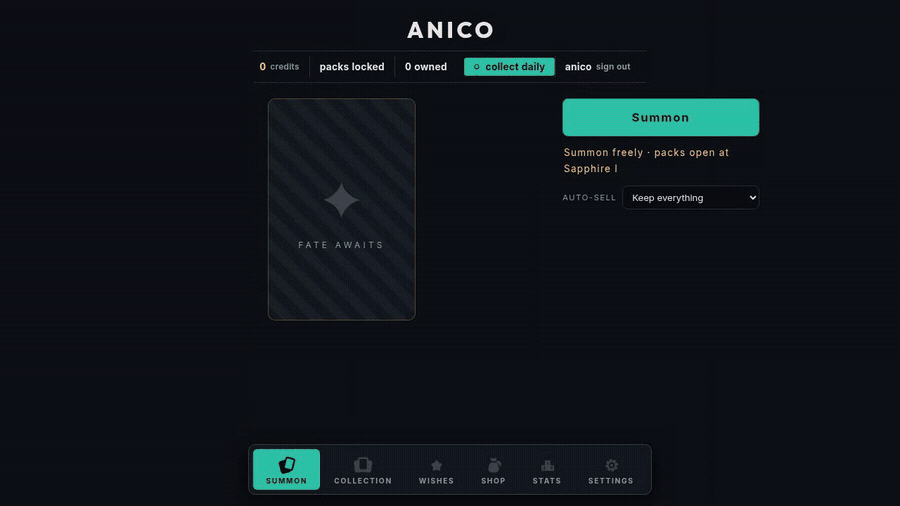
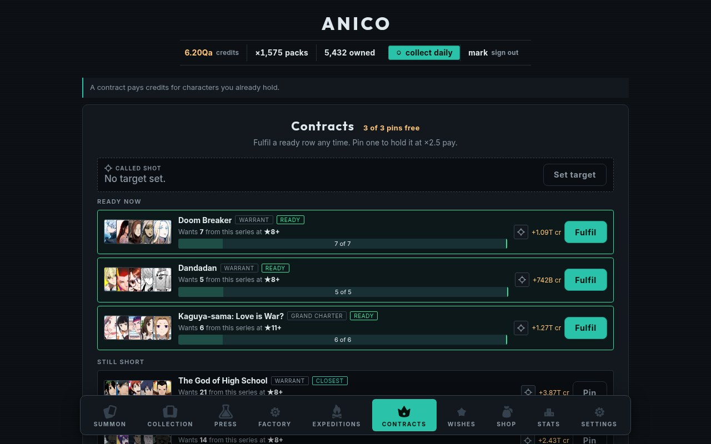
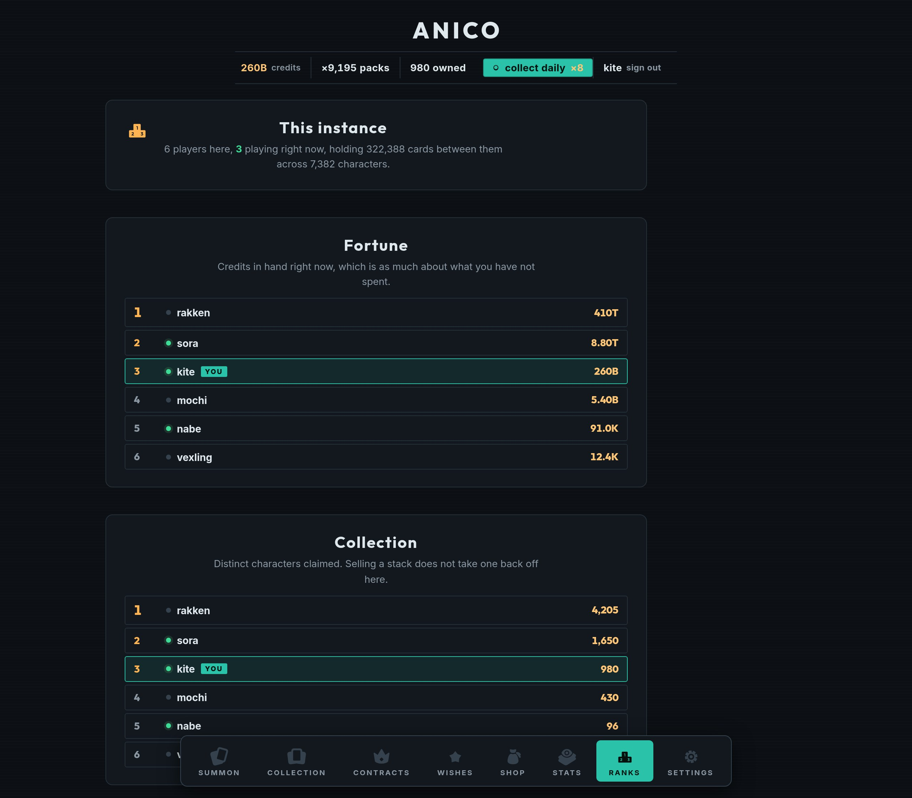

# Anico 🎴

A self-hosted anime card collecting game. No Discord bot, no commands: a web app you run
on your own box, open in a browser, and play. Pull packs, keep what you like, sell the
rest, and spend the credits on a shop that never runs out of things to sell you.



*One save from its first card: the free single summon, a first ten-card pack, ten packs of
nineteen hundred, and then the collection, the contract board and the shop that priced it.
Same clip as a [WebM](./docs/img/hero.webm), at twice the size and a third of the weight.*

**[Play the demo](https://demo.anico.markmartinez.ca/)** if you would rather try it than read
about it. It is the real game with the real rules, running entirely in your browser: no
account, no server, and nothing saved.

Characters and art come from the [AniList API](https://docs.anilist.co/), fetched once by
the server and cached in the instance's own database. One deployment is an **instance**;
players share it but their collections are separate.

## What you do

### Pull packs

A single summon is free and unlimited. Packs cost credits and hold more: ten cards at the
first Sapphire badge, thousands once Pack Size has a few levels on it, across as many
wrappers as Extra Packs has bought.

Packs are sealed. One drag tears every wrapper in the pull, and each swipe after that
takes the top card off every stack, so fifty packs are the same gesture as one. Hands off,
<kbd>Space</kbd> and the button open them at your current **Open Speed**. It is only
ceremony: every card is yours the moment the pack is bought.

Open Speed also decides how much of a pull arrives as real cards. The rest is appraised
into credits as the pack drains, at what those cards averaged
([ADR 0007](./docs/adr/0007-the-numbers-have-no-ceiling.md)).


### Keep what is worth keeping

Duplicates stack, and every doubling merges a stack one star higher: ★1 at two copies,
★2 at four, ★3 at eight. Each star multiplies what the stack sells for, so holding
sixteen copies beats selling them as they arrive.

Set **auto-sell** to a rarity and anything below it is sold when you next summon. The gap
is deliberate: it is your chance to **lock** anything you want to keep.


### Spend it

**Upgrades** raise your rates and mostly have no maximum level. **Badges** are six tiers
each and change how the game works: they unlock packs, add wish slots, and guarantee
rarities. Every level costs more than the last and more than the effect it buys, so the
next purchase is always a little further off, and the balance never runs away
([ADR 0015](./docs/adr/0015-the-works-were-a-firework.md)).

One row buys one level, ten, twenty-five, or as many as the balance covers. Past ten
thousand, numbers are quoted as 4.18B or 12.4Qa.


### Let it run

**Auto Summon** presses the button for you: tears the wrappers, swipes the cards away,
presses again, faster with every level. It runs on any tab, and you can swipe along with
it. Add **Offline Earnings** and it keeps paying with the game closed.

### Chase a contract

Each contract names a series and a depth and pays for holding that many characters that
deep, so a character can be worth wanting for a reason that is not its credit value.
Nothing expires and nothing is gambled. Rewards are stored as a number of *pulls*, so a
contract is the same size of prize at ten thousand credits and at a quadrillion.

**Called Shot** aims a share of every pull at the series you name, **Split Aim** points it
at up to six at once, and **Auto Aim** re-points it at whatever you are closest to
finishing.



### See where everybody is

Six boards, ranked across the instance: credits in hand, characters claimed, cards held,
the brightest stack anybody has merged, the best card anybody has pulled, and summons
pressed. Your own row is marked wherever it lands, and it is appended below the top ten if
you did not make it.

The dot matters more than the ranking. No rule in Anico is competitive: nobody can take a
card off you, and nobody's collection changes anybody else's draws. So the point of this
page is not the race. It is knowing that the other accounts are being played, and that
somebody else is summoning right now. Sandbox profiles are left off every board.



### The rest

- **Two devices at once**: the server owns every rule and pushes the result to every open
  tab, so a phone and a desktop never disagree and two copies of Auto Summon really do
  earn twice as fast
- **Wishes**: pin characters by name; they turn up rarely on purpose
- **Coins**: drop on about one summon in fifty
- **Series sets**: 3, 5 and 10 characters from one show pay a bonus
- **Daily bonus**, **stats charts**, **three themes**, and a PWA install
- **Change your name** whenever you like, in Settings, confirmed with your password. The
  boards and the admin's invite list follow it
- **Nothing shouts on a phone**: receipts, meaning what a pull earned and what a stack
  merged to, are desktop only. Four at once cover the bottom of a small screen and the
  numbers are all in the header anyway. Refusals still arrive, at any size
- **Admin**: the character pool, the catalog crawl, invite links and accounts, in Settings


## The demo

[demo.anico.markmartinez.ca](https://demo.anico.markmartinez.ca/) is the whole instance
compiled into a static page. The same Hono app, the same rules in `server/game.ts`, the
same migrations, over SQLite compiled to WebAssembly: the server runs in the tab, and
nothing in it knows the difference.

It is a build target rather than a fork, so a new route or a changed price reaches it with
no work. What differs is only what a public page cannot honestly offer:

- **No accounts.** One guest, minted on load, given a starting balance so the first pack
  is a click away rather than a grind.
- **Nothing saved.** The database is bytes in memory. A refresh is a new visitor.
- **Wishes is locked.** Pinning a character means searching AniList, and a public demo has
  no business spending somebody else's rate limit. Locking it also means the demo makes no
  external API call at all; card art is still hot-linked, as it is in an instance.
- **No offline earnings, no Auto Summon with the tab closed, no multi-device sync.** All
  three are genuinely server behaviours. The clips above are where they live.

Building it:

```sh
npm run bake:catalog   # crawls AniList once and writes demo/public/catalog.db
npm run build:demo     # into dist/demo
npm run preview:demo   # serves it at the deployed base path
npm run smoke:demo     # boots it in a real browser and plays it
```

The catalog is a build input, not an output: it takes a while to crawl politely, so it is
committed. Regenerate it when you want the popularity ranking refreshed.

`npm test` runs the demo's SQLite shim against real better-sqlite3, case for case, and
carries the guards that keep the demo honest: a second path to `/api`, a Node import in
the rules, or a route that stops answering with the state it published all fail the suite
rather than the demo.

## Running an instance

Every push to `master` publishes a multi-arch image to GHCR. A server needs two files:

```sh
ssh server 'mkdir -p /srv/anico'
scp docker-compose.yml setup.sh .env.example server:/srv/anico/
ssh server 'cd /srv/anico && ./setup.sh && docker compose up -d'
```

[`setup.sh`](./setup.sh) checks Docker is reachable, writes a `.env` from the example,
and creates `./anico-data` owned by the uid the container actually runs as. It asks the
image rather than assuming, and it is safe to re-run. The image is a public package, so
the server pulls it anonymously.

Building from source instead:

```sh
docker compose -f docker-compose.yml -f docker-compose.build.yml up -d --build
```

Once it is up:

1. **Create the first account.** It becomes the admin. No credentials are baked in.
2. The catalog fills in the background: four sweeps of AniList, 800 requests 15s apart, so
   a complete catalog takes about 3½ hours and resumes if you restart. You can play
   immediately, because the first sweep is most-popular-first.
3. Invite the others: **Settings, Instance, Create an invite link.** A link carries a seat
   count: one use, five, twenty-five, or no limit, which is the one to paste into a group
   chat. Each row shows the URL, how many seats are spent and who came through it.
   Withdrawing a link nobody used deletes it; withdrawing one people joined through keeps
   the row, because it is the record of how those accounts exist. Registration is closed to
   anyone without a link.

### Behind a reverse proxy

The instance speaks plain HTTP on localhost. Copy the block from
[`Caddyfile.example`](./Caddyfile.example):

```caddy
anico.example.com {
	encode zstd gzip
	reverse_proxy 127.0.0.1:8080
}
```

On a LAN with no TLS, publish the port directly and set `COOKIE_SECURE: "false"`, or the
browser drops the session cookie and login appears to do nothing.

### Configuration

| Variable | Default | What it does |
| --- | --- | --- |
| `PORT` | `8080` | Port the server listens on |
| `DATA_DIR` | `/data` | Where `anico.db` lives. Back this directory up |
| `COOKIE_SECURE` | `true` | Session cookie's `Secure` flag. `false` for plain-HTTP LAN |
| `CRAWL_ON_BOOT` | `true` | Fill the character catalog on startup |
| `CRAWL_DELAY_MS` | `15000` | Gap between catalog requests |
| `MAX_DB_BYTES` | `1073741824` | The crawl stops rather than grow past this |
| `CLIENT_DIR` | `/app/dist/client` | Where the built client is served from |

`ANICO_IMAGE` defaults to `ghcr.io/rakkenti/anico:latest`, lowercase even though the
repo is not. Override it to pin a tag, which is how you freeze on a known-good build or
roll back; watchtower will not move you off a pinned tag.

### Data and backups

The compose file bind-mounts `./anico-data` beside itself, so the database is somewhere
you can see and rsync. It survives `docker compose down` and image upgrades.

The whole instance is one SQLite file, so a backup is: **stop the container and copy the
directory.** Stopping is what makes it safe: the server folds the write-ahead log into
`anico.db` on `SIGTERM`, leaving one self-contained file. Copying from a running instance
can silently miss everything since the last checkpoint. Restoring is the reverse: drop the
file back with the container stopped, remove the `-wal` / `-shm` sidecars, and
`chown 1000:1000` it.

### Watchtower and autoheal

The compose file ships both: watchtower recreates the containers when a newer image
appears, autoheal restarts anything whose healthcheck has gone unhealthy. Both are scoped
by label, so neither touches anything else on the box. Two things to know: both need
`/var/run/docker.sock`, which is equivalent to root on the host, and watchtower following
`:latest` means **migrations run unattended**. Pin a tag if you would rather approve each
upgrade, or drop either service from the file.

Open tabs take care of themselves. The instance hashes the client it is serving and
announces that on every live connection, so a container that comes back on a new image is
noticed by every browser still pointed at it: they say so and reload, once nothing is
mid-pull. Nobody is left on last week's bundle talking to this week's API.

## Development

```sh
npm install
npm run build         # client into dist/client, server into dist/server
npm start             # the built server on :8080
npm run dev           # Vite on :5173, proxying /api to :8080
npm run lint          # oxlint
npm test              # the demo's SQLite shim, and the drift guards
```

Run `npm start` and `npm run dev` together for hot reload against a live API. Point the
proxy elsewhere with `ANICO_API=http://127.0.0.1:8090 npm run dev`, which is how you work
against a throwaway seeded instance without touching the one you play on.

`npm run shots` drives a running instance with a real browser and writes screenshots at
desktop and phone sizes, including the states that only exist mid-gesture, like a pack
half torn or a card in flight. That is where the mobile bugs have been.

`npm run stress` plays the end game, which is where every performance problem this project
has had turned up. It stands up its own instance, seeds a catalog the size a real crawl
reaches, and walks a player up five rungs of the shop, up to eleven million cards a pull
in forty-one wrappers against a collection of sixty-five thousand characters. It measures
the press-to-wrappers delay, frame gaps, opening against what Open Speed promised, sound
voices, wrapper widths, whether every guarantee was kept, whether the board posts and
prices itself, and whether a whole collection can be sold. It exits non-zero on anything
over budget.

Both need a Chromium on the machine: `npx playwright install chromium`, or point
`PLAYWRIGHT_CHROMIUM` at one.

## How it fits together

- **Client**: React 19 + Zustand + Vite. Mirrors the server's snapshot, plus browser-only
  state. Installable as a PWA. Icons are Kenney's CC0 art painted as CSS masks, so one
  file follows every theme.
- **Server**: Hono on Node, one process serving the API and the built client. Owns every
  rule that could otherwise be cheated
  ([ADR 0003](./docs/adr/0003-the-server-owns-the-rules.md)). Writes are serialised and
  atomic; every mutation is pushed to the player's other devices over SSE.
- **Database**: SQLite in the app container, no separate service
  ([ADR 0001](./docs/adr/0001-sqlite-in-one-container.md)).
- **Catalog**: the instance's own table of characters, filled from AniList in four sweeps
  because no single query paginates past 5000 entries. Rolls are a local `SELECT`, so play
  does not depend on AniList being reachable.

The vocabulary is in [`CONTEXT.md`](./CONTEXT.md); the decisions worth not re-litigating
are in [`docs/adr/`](./docs/adr/).

## Licence

[AGPL-3.0](./LICENSE). Run it, change it, host it for your friends. If you run a modified
version as a service for other people, publish your changes.

*This is an unaffiliated fan project. Character data © their respective owners, served by
AniList. Icons and sound effects (CC0) by [Kenney](https://kenney.nl/assets); the icons are
vendored in [`src/assets/icons`](./src/assets/icons) with their licence.*
